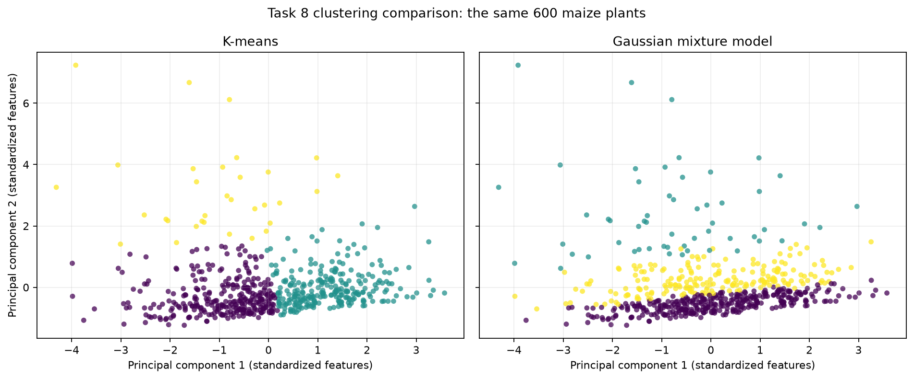
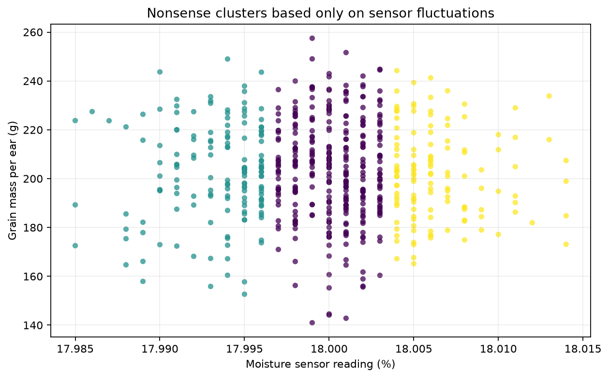

# Task 8: Clustering — choose, break, explain

## Question

The clustering analysis asks whether the 600 sampled maize plants form distinct productivity groups based on ear development, grain production and leaf damage. In this analysis, a productivity group is a set of plants with similar ear length, grain mass per ear and level of leaf damage. These measurements jointly describe ear development, production and plant condition at harvest. Cluster descriptions are based on the results rather than assigned before fitting the models.

The data were generated mainly from continuous distributions. Therefore, an algorithm returning labels does not by itself prove that natural biological groups exist.

## Selected features

| Feature | Reason for selection |
|---|---|
| `ear_length_cm` | Describes physical development of the principal maize ear at harvest. |
| `grain_mass_per_ear_g` | Measures harvest production from the sampled plant. |
| `leaf_damage_percent` | Describes plant condition and distinguishes heavily damaged plants from plants with limited damage. |

The three features represent ear development, production and damage, which directly address the question. All 600 observations were used by both methods.

## Data preparation

No feature transformation was applied. The original leaf-damage values were retained so that the analysis remained simple and the feature kept its direct interpretation.

The three features use different units and numerical ranges. They were standardized to mean zero and population standard deviation one before either model was fitted. This prevents grain mass, whose values are numerically much larger than ear length or leaf damage, from dominating the distance and covariance calculations merely because of its unit.

## Methods and assumptions

### K-means

K-means assigns every observation to its nearest cluster centre using squared Euclidean distance. It works best when groups are compact, approximately spherical in the standardized feature space and have reasonably similar spread. Ten reproducible K-means++ initializations were compared, and the solution with the lowest within-cluster sum of squared distances was retained.

### Gaussian mixture model

The Gaussian mixture model (GMM) represents the data as a weighted mixture of Gaussian distributions. Full covariance matrices were used, allowing groups to have different spreads, orientations and elongated shapes. This flexibility is relevant because ear length and grain mass are strongly correlated. The GMM was fitted by expectation-maximization from a reproducible K-means initialization.

Both final models used three clusters. This gave a direct comparison using the same observations, selected features and standardization.

## Evaluation results

The silhouette score was calculated from the same standardized data for both partitions. Higher values indicate that observations are, on average, closer to their own cluster than to neighbouring clusters.

| Method | Silhouette score | Cluster sizes | Noise points |
|---|---:|---|---:|
| K-means | 0.4242 | 303, 265, 32 | 0 |
| GMM | 0.1211 | 341, 55, 204 | 0 |

K-means and GMM assign every observation to a cluster and do not have a noise label, so zero noise points is a property of these methods rather than evidence that the data contain no unusual observations.

The silhouette score is undefined when fewer than two clusters are represented or when every observation forms its own cluster. The implementation reports an undefined score with an explanation in either situation. Both results above contain three represented clusters, so both scores are defined.

## Cluster profiles

The following averages use the original units. Cluster numbers are arbitrary identifiers and should be interpreted through their profiles.

### K-means profiles

| Cluster | Plants | Ear length (cm) | Grain mass per ear (g) | Leaf damage (%) | Interpretation |
|---:|---:|---:|---:|---:|---|
| 0 | 303 | 17.55 | 189.11 | 2.35 | Shorter ears and lower grain mass, with limited damage. |
| 1 | 265 | 20.75 | 220.34 | 2.21 | Longer ears and higher grain mass, with limited damage. |
| 2 | 32 | 18.78 | 188.60 | 13.58 | Much greater leaf damage and lower grain mass. |

### GMM profiles

| Cluster | Plants | Ear length (cm) | Grain mass per ear (g) | Leaf damage (%) |
|---:|---:|---:|---:|---:|
| 0 | 341 | 18.99 | 204.24 | 1.09 |
| 1 | 55 | 19.00 | 191.65 | 11.01 |
| 2 | 204 | 19.11 | 203.63 | 3.70 |

## Comparable plots

The two panels below show exactly the same 600 observations. Both models were fitted using all three standardized features. For a comparable two-dimensional display, the observations were projected onto the same first two principal components, and both panels use shared axes and plotting settings.

## Choice and interpretation

K-means is the better final method for this question and dataset. It achieved the higher silhouette score and produced three readily interpretable productivity groups: a lower-production group, a higher-production group, and a smaller high-damage group. The GMM allowed more flexible covariance shapes, but its substantially lower silhouette score indicates much greater overlap between its assigned groups. Its three profiles mainly separate different levels of leaf damage while showing nearly identical average ear lengths.

The K-means result should still be interpreted cautiously. Its high-damage cluster contains only 32 plants, and the dataset was constructed from mostly continuous distributions rather than from three known biological populations. The right-skewed leaf-damage feature also helps isolate the small high-damage group. Consequently, the clusters are useful descriptive productivity groups, but they do not demonstrate the existence of three natural maize populations. A higher internal score supports the comparison between these two final partitions; it does not establish scientific meaning on its own.

## Deliberately nonsensical clustering

For the failure experiment, K-means was run using only `moisture_sensor_percent`. This almost constant sensor records tiny fluctuations and does not describe productivity. The algorithm is valid, but the feature is unsuitable for the scientific question. K-means nevertheless divided all 600 plants into three groups.

### Results

Table 1 evaluates the same nonsense labels in two spaces. The first row asks whether they separate the sensor values used by K-means; the second asks whether they separate the meaningful productivity features.

| Evaluation space | Silhouette score | Meaning |
|---|---:|---|
| Moisture sensor used for clustering | 0.5407 | The small sensor fluctuations form mathematically separated intervals. |
| Ear length, grain mass and leaf damage | -0.0284 | The same labels fail to separate productivity and condition. |

Table 2 shows the practical result. It reports the productivity measurements for the groups created from the sensor readings.

| Cluster | Plants | Ear length (cm) | Grain mass (g) | Leaf damage (%) |
|---:|---:|---:|---:|---:|
| 0 | 320 | 19.15 | 203.58 | 3.00 |
| 1 | 152 | 18.99 | 202.46 | 2.91 |
| 2 | 128 | 18.77 | 201.63 | 2.56 |

The two tables are connected: Table 1 shows that the labels look successful only in the irrelevant sensor space, while Table 2 shows that the resulting groups have nearly identical ear length, grain mass and leaf damage. The positive sensor-space score of 0.5407 therefore coexists with a negative productivity-space score and no useful productivity distinction. This demonstrates that a good internal score can support a mathematically valid partition that is nonsense for the scientific question.

### Why it is bad and what remains uncertain

Standardization gave tiny sensor fluctuations full importance, and K-means had to assign every plant to a group. The result reveals sensitivity to irrelevant features and a mismatch between the model input and the purpose of the analysis. It remains uncertain whether the Part 1 productivity groups represent natural biological populations: the data are synthetic, the distributions are mainly continuous, and different features or cluster counts could change the result. Internal scores cannot resolve that uncertainty without domain knowledge or independently known groups.
