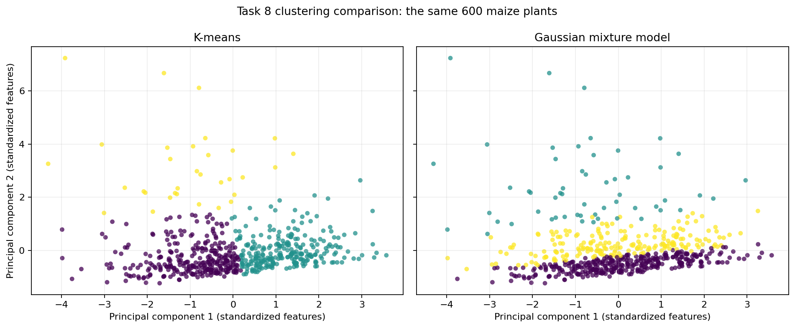
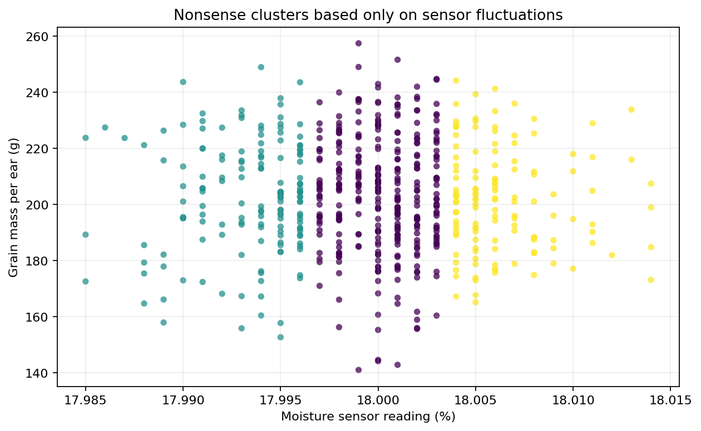
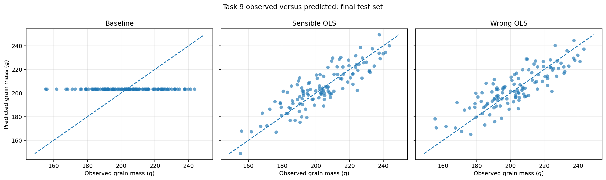

# Project 2 — Data Generation and Distribution Analysis 

## Project overview 

This project develops a reusable Python workflow for generating, checking, analysing, visualising, and later modelling numerical data.

For Part A, a synthetic agriculture dataset is created representing plant-level observations from a French maize field. The dataset was designed deliberately so that the statistical properties and relationships between variables are known before analysis. This makes it possible to test whether the implemented statistical tools correctly identify properties that were intentionally built into the data.

The project is divided into separate modules:

* `data_tools.py` — generates the dataset and checks its integrity.
* `stats_tools.py` — contains implementations of the statistical calculations.
* `plot_tools.py` — creates and saves visualisations.
* `code.py` — runs the complete workflow for the selected dataset.
* `test_data_tools.py` — tests the data generation and integrity checks.
* `test_stats_tools.py` — tests the statistical implementations.

The tools are designed to receive data as input rather than depending on the maize dataset directly. The dataset-specific decisions are kept in `code.py`.

---

## Task 2 — Synthetic dataset

### Dataset description

The synthetic dataset contains 600 plant-level observations and six columns:

| Feature                   | Type        | Description                                  |
| ------------------------- | ----------- | -------------------------------------------- |
| `plant_height_cm`         | Numerical   | Height of the maize plant in centimetres     |
| `leaf_damage_percent`     | Numerical   | Percentage of leaf damage                    |
| `moisture_sensor_percent` | Numerical   | Soil/field moisture sensor measurement       |
| `ear_length_cm`           | Numerical   | Length of the maize ear in centimetres       |
| `grain_mass_per_ear_g`    | Numerical   | Grain mass per maize ear in grams            |
| `field_zone`              | Categorical | Location of the observation within the field |

The dataset contains five numerical features and one categorical feature, satisfying the requirement for at least five numerical variables and a meaningful categorical variable.

A fixed NumPy random seed (`42`) is used so that the same dataset can be reproduced.

### Deliberately generated properties

The data was generated so that several properties are known in advance.

`plant_height_cm` and `ear_length_cm` are approximately symmetric variables. For example, the measured skewness of `ear_length_cm` is approximately `-0.0215`, which is very close to zero.

`leaf_damage_percent` is deliberately right-skewed using a log-normal distribution. Its measured skewness is approximately `3.1657`, showing a strong positive tail.

`moisture_sensor_percent` is designed to be almost constant around 18%. Its standard deviation is approximately `0.0050`, which is very small relative to its mean of approximately 18%.

The dataset also contains a deliberate relationship between `ear_length_cm` and `grain_mass_per_ear_g`. Grain mass is generated partly from ear length, so longer ears tend to have greater grain mass. The measured Pearson correlation between these variables is approximately `0.857`.

The categorical variable `field_zone` represents different areas of the maize field. Different zones are given small effects on some numerical measurements, making the category meaningful rather than an arbitrary label.

### Reproducibility

The dataset is generated using NumPy's random number generator with a fixed seed:

```python
rng = np.random.default_rng(42)
```

This means that the generated observations are reproducible.

---

## Task 3 — Check the data integrity

A general `check_data_integrity()` function was implemented in `data_tools.py`.

The function receives a pandas DataFrame and optional expectations such as:

* expected columns
* expected shape
* expected data types
* expected numerical ranges

It checks for:

* missing columns
* unexpected shape
* missing values
* duplicate rows
* incorrect data types
* values outside specified ranges

The function returns a report dictionary and prints a clear pass/fail message.

The integrity function is intentionally general. It does not contain maize-specific assumptions unless those assumptions are supplied by the calling code.

### Deliberate failure tests

The test suite creates deliberately corrupted versions of the generated dataset.

The following cases are tested:

1. A valid dataset should pass.
2. A NaN value should be detected.
3. A duplicated row should be detected.
4. An impossible numerical value should be detected.
5. A required column that has been removed should be detected.

This verifies that the integrity checker can identify common data-quality problems rather than only confirming that the original dataset is valid.

---

## Task 4 — Describe the distributions

The statistical calculations are implemented in `stats_tools.py` without using `scipy.stats.skew` or `scipy.stats.entropy` in the actual implementations.

The following calculations are performed for every numerical feature:

* histogram-based probability density function (PDF)
* cumulative distribution function (CDF)
* mean
* population standard deviation
* skewness
* Shannon entropy

### Histogram bin choice

A fixed value of **25 bins** is used for the histogram-based PDF, CDF, and entropy calculations.

Using the same number of bins makes the distributions comparable between features and also provides a consistent basis for later entropy and KL-divergence calculations.

The bin count is explicitly defined in `code.py` as:

```python
NUMBER_OF_BINS = 25
```

### Probability density function

The PDF is estimated from a histogram. The histogram counts are converted into density values by accounting for both the number of observations and the width of each bin.

The important property is that the **area under the PDF is approximately 1**, rather than simply requiring the sum of the histogram heights to equal 1.

### Cumulative distribution function

The CDF is calculated from the histogram probabilities by taking their cumulative sum. The resulting values are non-decreasing and finish at approximately 1.

### Mean and standard deviation

The mean describes the central value of each numerical feature. The population standard deviation measures the typical spread around that mean.

For example, the moisture sensor feature has a very small standard deviation, demonstrating that its observations are concentrated very closely around 18%.

### Skewness

Skewness measures asymmetry in a distribution.

The main examples in this dataset are:

* `ear_length_cm`: approximately symmetric, with skewness close to zero.
* `leaf_damage_percent`: strongly right-skewed, with skewness approximately `3.17`.

### Shannon entropy

Shannon entropy is calculated from the histogram probabilities using base-2 logarithms, so the result is expressed in **bits**.

The entropy calculation depends on the chosen number of histogram bins. Therefore, the same binning approach is used consistently when comparing features.

### Visualisations

The following figures are generated and saved in the `figures/` directory:

* histogram for each numerical feature
* PDF for each numerical feature
* CDF for each numerical feature
* frequency bar chart for `field_zone`
* 2D scatter plot of `ear_length_cm` versus `grain_mass_per_ear_g`

The ear-length/grain-mass scatter plot was selected because these variables were deliberately generated with a positive relationship. The measured correlation is approximately `0.857`, making the relationship visible in a 2D plot.

All numerical axes include appropriate units where applicable.


## Task 5 — What is entropy good for?

1) In summary statistics, we got following entropy_bits and standard deviation:

| feature                   | std         | entropy bits  |
| ------------------------- | ----------- | ------------- |
| `plant_height_cm`         | 18.3428     | 3.8728        |
| `leaf_damage_percent`     | 3.2966      | 2.7251        |
| `moisture_sensor_percent` | 0.0050      | 4.0754        |
| `ear_length_cm`           | 2.0191      | 4.1169        |
| `grain_mass_per_ear_g`    | 20.1209     | 4.1015        |


If we compare the almost constant feature (`moisture_sensor_percent`) and the widest feature (`grain_mass_per_ear_g`) we see that despite std of `moisture_sensor_percent` (0.0050) is so different compared to `grain_mass_per_ear_g` (20.1209), their entropy bits are very close (4.0754 and 4.1015). This happens because entropy calculation is based on the probabilities of observations falling into histogram bins, so entropy and std measure different things:

- Entropy measures uncertainty in which bin an observation will fall into, given the chosen binning.

- Standard deviation measures physical numerical spread. 

If our goal is to learn something that varies from plant to plant, then the wide measurement is better than almost constant measurement -> Grain Mass measurement is more informative. The interesting thing is that entropy alone doesn't clearly distinguish them, since the uncertainty is very similar for both features.

2) What happens if a measurement has entropy = 0? It basically means that there is no uncertainty in which bin an observation will fall into, so every measurement will fall into the same bin.
Therefore, before measuring, you already know exactly where the next measurement will fall. So, no additional measurements are required, since you already know the result.

3) Suppose that we have a histogram with 8 bins, and the next observation could be in any of them with equal probability. 

The Shannon entropy is calculated as:

$$
H = -\sum_{i=1}^{n} p_i \log_2(p_i)
$$

So,

$$
\log_2(8) = 3
$$

Gives us 3 yes/no questions, and it means the uncertainty is roughly equivalent to needing 3 binary decisions on average to identify the next bin, depending on the probability distribution.

For 25 bins the theoretical maximum becomes,

$$
\log_2(25) = 4.64
$$

And if we compare the theoretical maximum entropy with one of our features (f.ex. `ear_length_cm` = 4.1169), we see that 4.1169 < 4.64, so that means our distribution has less uncertainty than the maximum possible uncertainty for 25 bins (the maximum entropy/uncertainty can be achieved only when all 25 bins are equally likely). So, the number we computed makes sense.

4) I we run "code.py", one of the parts we get in terminal is following:

Feature: ear_length_cm
Number of bins: 25

| Transformation | Standard deviation | Entropy |
|---|---:|---:|
| **Original** | 2.0191 | 4.1169 bits |
| **After multiplying by 1000** | 2019.1411 | 4.1169 bits |
| **After adding 50** | 2.0191 | 4.1169 bits |  

Thus, we observe that std is sensitive to scale (it changes dramatically from 2.0191 to 2019.1411), but if we simply move everything (x -> x + 50), then std doesn't change.
So standard deviation tells us about physical/numerical spread.

While entropy, on the other hand, doesn't care about the absolute measurement scale in the same way. It also doesn't care about simply moving the whole distribution. That is why entropy remains the same in all experiments. 

5) To find out which 2 features are reasonable to keep, we can create a correlation matrix in code.py:

| Variable                    | plant_height_cm | leaf_damage_percent | moisture_sensor_percent | ear_length_cm | grain_mass_per_ear_g |
| --------------------------- | --------------: | ------------------: | ----------------------: | ------------: | -------------------: |
| **plant_height_cm**         |           1.000 |              -0.019 |                   0.027 |         0.064 |                0.154 |
| **leaf_damage_percent**     |          -0.019 |               1.000 |                  -0.054 |        -0.020 |               -0.180 |
| **moisture_sensor_percent** |           0.027 |              -0.054 |                   1.000 |        -0.036 |               -0.016 |
| **ear_length_cm**           |           0.064 |              -0.020 |                  -0.036 |         1.000 |                0.857 |
| **grain_mass_per_ear_g**    |           0.154 |              -0.180 |                  -0.016 |         0.857 |                1.000 |

**Entropy of each feature:**

plant_height_cm: 3.8728 bits  
leaf_damage_percent: 2.7251 bits  
moisture_sensor_percent: 4.0754 bits  
ear_length_cm: 4.1169 bits  
grain_mass_per_ear_g: 4.1015 bits

We would keep `ear_length_cm` and `leaf_damage_percent`. Ear length has high entropy and a strong relationship with grain mass, while leaf damage provides different information about plant condition. I would not choose the moisture sensor because its standard deviation is extremely small, indicating that it is almost constant. I also would not automatically choose grain mass together with ear length, because their correlation is high (r ≈ 0.857), meaning that the two features contain overlapping information. Therefore, entropy alone is not sufficient for feature selection; correlation and the meaning of the features also need to be considered.

## Task 6 Kullback-Leibler divergence

If a feature's distribution is very similar to a Gaussian distribution, its KL divergence from the matching Gaussian should be relatively small. If the feature's distribution is very different from the Gaussian, its KL divergence should be larger.

If we run updated code.py, we get this table:

KL divergence:
               | Feature | KL(P‖Q) (bits) | KL(Q‖P) (bits) |
|---|---:|---:|
| **plant_height_cm** | 0.034685 | ∞ |
| **leaf_damage_percent** | 0.551120 | ∞ |
| **moisture_sensor_percent** | 0.078830 | 0.072575 |
| **ear_length_cm** | 0.020503 | 0.021184 |
| **grain_mass_per_ear_g** | 0.053493 | ∞ |

Therefore, your smallest values are:
- `ear_length_cm`: 0.020503
- `plant_height_cm`: 0.034685
- `grain_mass_per_ear_g`: 0.053493

These distributions are quite similar to their matching Gaussian distributions. This makes sense because their skewness values are -0.0215, -0.1163, and -0.1277. These values are close to zero, which means that the three features are fairly symmetric. However, being symmetric does not automatically mean that a distribution is Gaussian. It only tells us that the distribution is not strongly skewed.

Among the three features, `ear_length_cm` appears to be the most Gaussian. It has the smallest KL divergence (0.020503), meaning that its distribution is the closest to the matching Gaussian distribution. Its skewness is also closest to zero (-0.0215), indicating that it is fairly symmetric. `plant_height_cm` comes next, while `grain_mass_per_ear_g` has the largest KL divergence of the three.

Now, let's look at `leaf_damage_percent`. This feature has a much larger KL divergence than the other finite values. We also know that its skewness is 3.1657, which means that the distribution is strongly skewed and not very symmetric. This suggests that it does not have the typical bell shape of a Gaussian distribution. Therefore, the large KL divergence makes sense because the `leaf_damage_percent` distribution is quite different from a Gaussian distribution.

The interesting thing happens when we handle zeros q_i = 0 and p_i > 0. We have chosen to use Kullback–Leibler (KL) divergence formula:

$$
D_{KL}(P\parallel Q) = \sum_i p_i \log_2\left(\frac{p_i}{q_i}\right)
$$

So the KL divergence is measured in bits.
When $p_i = 0$, that term contributes 0. If $p_i > 0$ and $q_i = 0$,
the KL divergence is infinite.

## Task 7 Is KL a distance?

KL divergence can be used to quantify how different two probability distributions are, but it is not a true distance metric.

A metric must satisfy four properties:

**Non-negativity:** KL divergence satisfies this property because

$$
D_{KL}(P\|Q) \geq 0
$$

for valid probability distributions.

**Identity:** KL divergence satisfies this property because

$$
D_{KL}(P\|Q)=0
$$

when the two probability distributions are identical.

**Symmetry:** KL divergence does not satisfy symmetry. In general,

$$
D_{KL}(P\|Q) \neq D_{KL}(Q\|P)
$$

because the direction of the comparison matters.

**Triangle inequality:** KL divergence does not satisfy the triangle inequality. For three distributions \(P\), \(Q\), and \(R\), the calculated values were:

$$
D(P\|Q)=0.006759
$$

$$
D(Q\|R)=0.160779
$$

$$
D(P\|R)=0.202927
$$

The triangle inequality would require

$$
D(P\|R)\leq D(P\|Q)+D(Q\|R)
$$

In our case,

$$
D(P\|Q)+D(Q\|R)
=0.006759+0.160779
=0.167538
$$

while

$$
D(P\|R)=0.202927
$$

Therefore,

$$
0.202927>0.167538
$$

so the triangle inequality does not hold. This confirms numerically that KL divergence is not a metric.

Our results also show why KL should not be treated as an ordinary distance. For the `leaf_damage_percent` distribution and its Gaussian reference distribution, we obtained:

$$
D_{KL}(\text{leaf damage}\|\text{Gaussian})=0.551120
$$

while in the opposite direction,

$$
D_{KL}(\text{Gaussian}\|\text{leaf damage})=\infty
$$

If KL were treated as an ordinary symmetric distance, using only one of these values could give a misleading description of how different the two distributions are. The direction of the comparison must therefore be kept in the interpretation.

KL is still useful when the direction of the comparison has a meaning, for example when comparing an observed distribution with a reference distribution. In this project, it is useful for comparing our measured feature distributions with Gaussian reference distributions and for quantifying information difference.

When a genuine metric is needed for continuous observations represented as vectors, the course material introduces Euclidean, Manhattan, Minkowski, and Mahalanobis distance. The appropriate choice depends on the data and on what type of similarity or dissimilarity is important. For example, Mahalanobis distance takes covariance into account, while Euclidean distance is based directly on differences between feature values.


# Task 8: Clustering — choose, break, explain

## Question

The clustering analysis asks whether the 600 sampled maize plants form distinct productivity groups based on ear development, grain production and leaf damage. In this analysis, a productivity group is a set of plants with similar ear length, grain mass per ear and level of leaf damage. These measurements jointly describe ear development, production and plant condition at harvest. Cluster descriptions are based on the results rather than assigned before fitting the models.

The data were generated mainly from continuous distributions. Therefore, an algorithm returning labels does not by itself prove that natural biological groups exist.

## Selected features

| Feature | Reason for selection |
|---|---|
| `ear_length_cm` | Describes physical development of the principal maize ear at harvest. |
| `grain_mass_per_ear_g` | Measures harvest production from the sampled plant. |
| `leaf_damage_percent` | Describes plant condition and distinguishes heavily damaged plants from plants with limited damage. |

The three features represent ear development, production and damage, which directly address the question. All 600 observations were used by both methods.

## Data preparation

No feature transformation was applied. The original leaf-damage values were retained so that the analysis remained simple and the feature kept its direct interpretation.

The three features use different units and numerical ranges. They were standardized to mean zero and population standard deviation one before either model was fitted. This prevents grain mass, whose values are numerically much larger than ear length or leaf damage, from dominating the distance and covariance calculations merely because of its unit.

## Methods and assumptions

### K-means

K-means assigns every observation to its nearest cluster centre using squared Euclidean distance. It works best when groups are compact, approximately spherical in the standardized feature space and have reasonably similar spread. Ten reproducible K-means++ initializations were compared, and the solution with the lowest within-cluster sum of squared distances was retained.

### Gaussian mixture model

The Gaussian mixture model (GMM) represents the data as a weighted mixture of Gaussian distributions. Full covariance matrices were used, allowing groups to have different spreads, orientations and elongated shapes. This flexibility is relevant because ear length and grain mass are strongly correlated. The GMM was fitted by expectation-maximization from a reproducible K-means initialization.

Both final models used three clusters. This gave a direct comparison using the same observations, selected features and standardization.

## Evaluation results

The silhouette score was calculated from the same standardized data for both partitions. Higher values indicate that observations are, on average, closer to their own cluster than to neighbouring clusters.

| Method | Silhouette score | Cluster sizes | Noise points |
|---|---:|---|---:|
| K-means | 0.4242 | 303, 265, 32 | 0 |
| GMM | 0.1211 | 341, 55, 204 | 0 |

K-means and GMM assign every observation to a cluster and do not have a noise label, so zero noise points is a property of these methods rather than evidence that the data contain no unusual observations.

The silhouette score is undefined when fewer than two clusters are represented or when every observation forms its own cluster. The implementation reports an undefined score with an explanation in either situation. Both results above contain three represented clusters, so both scores are defined.

## Cluster profiles

The following averages use the original units. Cluster numbers are arbitrary identifiers and should be interpreted through their profiles.

### K-means profiles

| Cluster | Plants | Ear length (cm) | Grain mass per ear (g) | Leaf damage (%) | Interpretation |
|---:|---:|---:|---:|---:|---|
| 0 | 303 | 17.55 | 189.11 | 2.35 | Shorter ears and lower grain mass, with limited damage. |
| 1 | 265 | 20.75 | 220.34 | 2.21 | Longer ears and higher grain mass, with limited damage. |
| 2 | 32 | 18.78 | 188.60 | 13.58 | Much greater leaf damage and lower grain mass. |

### GMM profiles

| Cluster | Plants | Ear length (cm) | Grain mass per ear (g) | Leaf damage (%) |
|---:|---:|---:|---:|---:|
| 0 | 341 | 18.99 | 204.24 | 1.09 |
| 1 | 55 | 19.00 | 191.65 | 11.01 |
| 2 | 204 | 19.11 | 203.63 | 3.70 |

## Comparable plots

The two panels below show exactly the same 600 observations. Both models were fitted using all three standardized features. For a comparable two-dimensional display, the observations were projected onto the same first two principal components, and both panels use shared axes and plotting settings.



## Choice and interpretation

K-means is the better final method for this question and dataset. It achieved the higher silhouette score and produced three readily interpretable productivity groups: a lower-production group, a higher-production group, and a smaller high-damage group. The GMM allowed more flexible covariance shapes, but its substantially lower silhouette score indicates much greater overlap between its assigned groups. Its three profiles mainly separate different levels of leaf damage while showing nearly identical average ear lengths.

The K-means result should still be interpreted cautiously. Its high-damage cluster contains only 32 plants, and the dataset was constructed from mostly continuous distributions rather than from three known biological populations. The right-skewed leaf-damage feature also helps isolate the small high-damage group. Consequently, the clusters are useful descriptive productivity groups, but they do not demonstrate the existence of three natural maize populations. A higher internal score supports the comparison between these two final partitions; it does not establish scientific meaning on its own.

## Deliberately nonsensical clustering

For the failure experiment, K-means was run using only `moisture_sensor_percent`. This almost constant sensor records tiny fluctuations and does not describe productivity. The algorithm is valid, but the feature is unsuitable for the scientific question. K-means nevertheless divided all 600 plants into three groups.

### Results

Table 1 evaluates the same nonsense labels in two spaces. The first row asks whether they separate the sensor values used by K-means; the second asks whether they separate the meaningful productivity features.

| Evaluation space | Silhouette score | Meaning |
|---|---:|---|
| Moisture sensor used for clustering | 0.5407 | The small sensor fluctuations form mathematically separated intervals. |
| Ear length, grain mass and leaf damage | -0.0284 | The same labels fail to separate productivity and condition. |

Table 2 shows the practical result. It reports the productivity measurements for the groups created from the sensor readings.

| Cluster | Plants | Ear length (cm) | Grain mass (g) | Leaf damage (%) |
|---:|---:|---:|---:|---:|
| 0 | 320 | 19.15 | 203.58 | 3.00 |
| 1 | 152 | 18.99 | 202.46 | 2.91 |
| 2 | 128 | 18.77 | 201.63 | 2.56 |

The two tables are connected: Table 1 shows that the labels look successful only in the irrelevant sensor space, while Table 2 shows that the resulting groups have nearly identical ear length, grain mass and leaf damage. The positive sensor-space score of 0.5407 therefore coexists with a negative productivity-space score and no useful productivity distinction. This demonstrates that a good internal score can support a mathematically valid partition that is nonsense for the scientific question.



### Why it is bad and what remains uncertain

Standardization gave tiny sensor fluctuations full importance, and K-means had to assign every plant to a group. The result reveals sensitivity to irrelevant features and a mismatch between the model input and the purpose of the analysis. It remains uncertain whether the Part 1 productivity groups represent natural biological populations: the data are synthetic, the distributions are mainly continuous, and different features or cluster counts could change the result. Internal scores cannot resolve that uncertainty without domain knowledge or independently known groups.


# Task 9: Linear regression — useful even when wrong?

## Split and models

The 600 independent observations were randomly split with seed 42 into 360 training, 120 validation and 120 final test rows. The split occurred before fitting. Training data fitted the initial models, validation data supported comparison and failure diagnosis, and the reserved test data were used once after the final configurations were refitted on training plus validation data.

All models used the same rows. The baseline always predicts the development-target mean. The sensible model is ordinary least squares with an intercept. The deliberately wrong model uses only ear length, violating the known relationship by omitting plant height and leaf damage. NumPy's least-squares solver was used; feature scaling was unnecessary because ordinary least squares is unaffected by units and retaining original units makes coefficients interpretable.

## Final test results

| Model | MAE (g) | RMSE (g) | R² |
|---|---:|---:|---:|
| Baseline | 17.4280 | 21.2909 | −0.0031 |
| Sensible linear model | 7.8799 | 9.4501 | 0.8024 |
| Wrong ear-length-only model | 8.0647 | 9.6035 | 0.7959 |

The sensible model generalized well: it substantially improved all three test metrics over the baseline, and its test R² of 0.8024 indicates that a linear model is suitable for most of the generated relationship. The remaining errors are consistent with the added random noise. The slightly negative baseline R² means its constant prediction was marginally worse than predicting the test-target mean; R² would be undefined if the evaluated target were constant, which the evaluation function reports explicitly.

## Coefficients and units

| Model element | Fitted value | Unit | Known value |
|---|---:|---|---:|
| Sensible intercept | 17.8231 | g | Includes the nearly constant moisture contribution |
| Ear length | 8.4203 | g per cm | 8.5 |
| Plant height | 0.1157 | g per cm | 0.12 |
| Leaf damage | −1.0565 | g per percentage point | −0.9 |
| Wrong-model intercept | 41.1029 | g | Not directly comparable because predictors are omitted |
| Wrong-model ear length | 8.5070 | g per cm | 8.5 |

The sensible coefficients closely recover the known generating relationship. Exact agreement is not expected because of noise, rounding, clipping and sampling variation.

## Predictions and residuals




The observed-versus-predicted figure uses the reserved test rows. The residual figure uses validation rows for failure diagnosis. For the wrong model, leaf damage and residuals had a correlation of −0.3545, compared with 0.0493 for the sensible model. The negative pattern shows that the ear-length-only model tends to overpredict grain mass as omitted leaf damage increases, confirming the violated assumption before the final test was examined.

## Making the wrong model useful

Although incomplete, the wrong model can be used as a quick ranking tool when only ear length is available. On the test set, its predictions correlated 0.8926 with observed grain mass. The 30 plants in its highest predicted quarter had an average actual grain mass of 230.47 g, compared with 203.82 g across all test plants. It can therefore screen for potentially productive plants with limited measurements.

This use is restricted to ranking or rough screening in data similar to the generated sample. The model should not provide precise individual estimates, especially for unusually damaged plants, and its coefficient must not be interpreted as a complete causal explanation. The data are synthetic, so performance on real fields remains uncertain.

# Task 10: Generic validation tests

## Code correctness and model suitability

Code-correctness tests check whether functions obey mathematical and programming requirements on known inputs. Model suitability asks whether the chosen inputs, assumptions and outputs answer the scientific question. Correct code can fit an unsuitable model, so passing tests cannot prove scientific meaning or model truth.

## Validation table

| Function or claim | Test input or transformation | Expected property | Assumptions | Tolerance and reason | Failure detected | Limitation |
|---|---|---|---|---|---|---|
| Histogram PDF normalization | `[0, 0, 1, 1]` with two bins | `sum(density × bin width) = 1` | Finite one-dimensional values and positive bin widths | `1e-12`, allowing only floating-point rounding | Normalizing density by its sum or forgetting bin widths | Does not prove that the selected bins describe the underlying distribution well |
| Integrity checker | Valid data deliberately changed with NaNs, a duplicate, an impossible value and missing columns | The report fails and contains all four error categories, with nine detected problems | Expected columns, types and ranges are supplied correctly | Exact error count and codes; no numerical tolerance is needed | Failure to detect non-finite, duplicate, out-of-range or incomplete observations | Cannot establish scientific truth or representative sampling |
| Ordinary least squares | Exact relationship `y = 2 + 3x` | Intercept 2, coefficient 3 and exact predictions | Linear relationship with no noise and a valid design matrix | `1e-12`, allowing numerical solver rounding | Missing intercept, incorrect design matrix, reversed inputs or faulty prediction | Does not show that linear regression suits the maize data |
| Complete workflow | Reproducible 30-observation dataset | Integrity passes; Tasks 4–9 return expected results, labels and figure files | Small data use the same schema and functions as the complete dataset | Exact counts and required keys; no fitted-value tolerance | Broken imports, missing outputs, inconsistent labels or disconnected task stages | A small successful run does not prove scientific quality or full-data stability |
| Regression leakage | Add 50 g only to reserved test targets, then rerun Task 9 | Coefficients, intercepts and fitted baseline stay unchanged; test RMSE changes | Fixed split and no test-target access during fitting | Fitted parameters unchanged within `1e-12`; changed RMSE must not be equal | Test targets used during model or baseline fitting | Checks this target-leakage route, not every possible leakage mechanism |

The suite also retains the earlier CDF, entropy, KL, skewness, standard-deviation and Task 7 checks. In total, 13 automated tests pass.

## Deliberately broken input

`test_all_required_corruptions_together` inserts three NaNs, one duplicate observation, one impossible percentage and four missing values. The test passes only when the integrity checker rejects the dataset and reports all nine problems. A passing test therefore means the bad input was detected, not that the corrupted dataset was accepted.

## Bad models can still be correctly implemented

The Task 8 nonsense K-means model is exposed by its silhouette of 0.5407 in the irrelevant sensor space but −0.0284 in the productivity space, together with nearly identical productivity averages. It still passes correctness checks: every observation receives one label, three clusters are represented and their sizes sum to the observation count. The algorithm correctly groups the unsuitable feature it was given, while the result fails the scientific purpose.

The Task 9 ear-length-only model is exposed by the validation correlation of −0.3545 between omitted leaf damage and its residuals, as well as its higher errors than the sensible model. It still passes the exact-line regression test and returns correctly shaped, finite predictions. The regression calculation is correct, but its predictor set deliberately omits known parts of the generating relationship.

## Running the suite

From the `FINAL` folder, run:

```bash
python -m unittest discover -v
```

The command uses Python's standard library test runner and requires no downloads.
